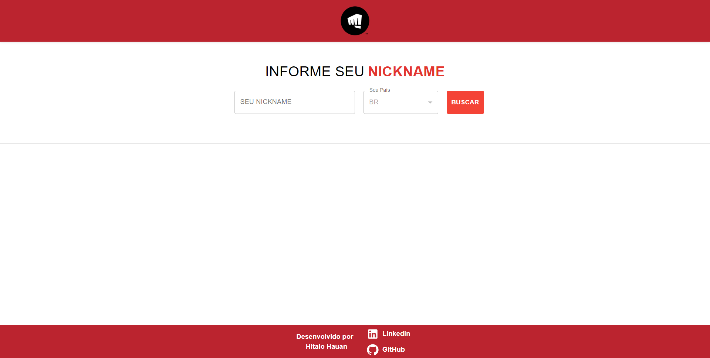
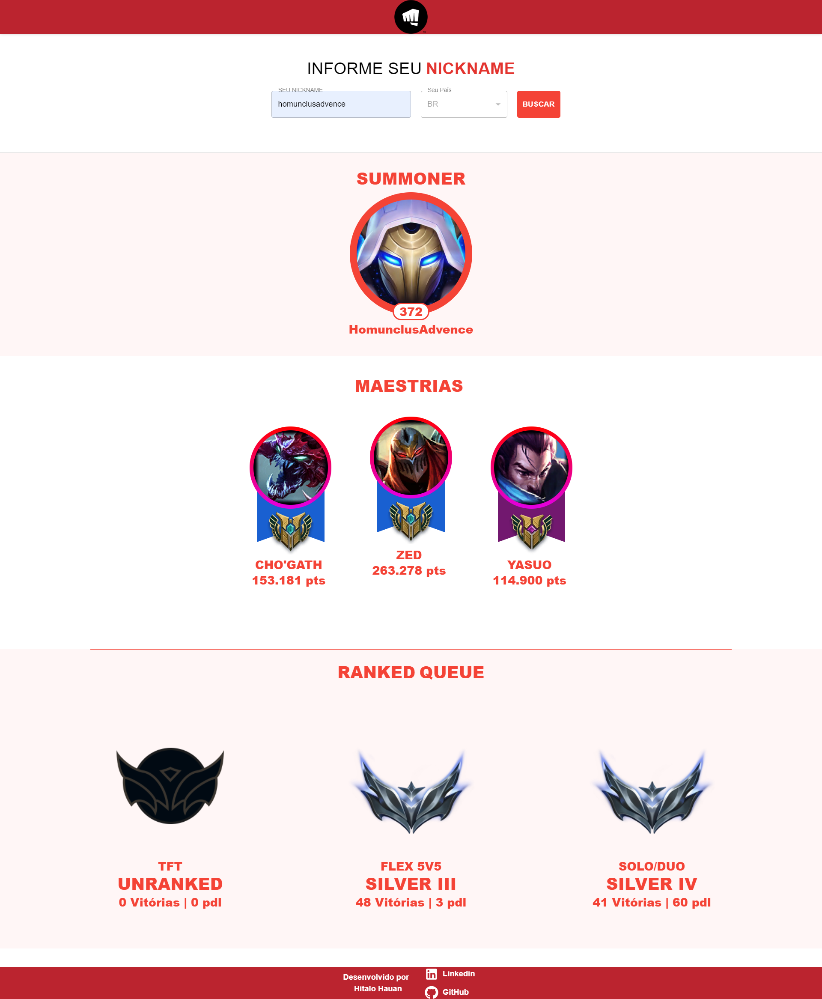
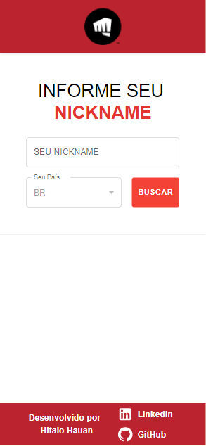
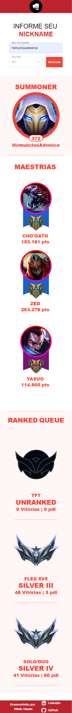

# League of legends - Search by Nickname

## Project Details

The project aims to exercise my knowledge in React, and works from the data received from requests made to the League of Legends public API.

### Summary

From Riot Games official api documentation, we can extract from League of Legends game nickname the data of any game account, 
to extract the following data:

- Champions mastery.
- Account level
- ranked queue position

Riot Games official api documentation: https://developer.riotgames.com/docs/lol

### Preview

Desktop Version:

Mobile Version:

### Social Networks

Linkedin: https://www.linkedin.com/in/hitalo-hauan-lacerda-avan%C3%A7o-90523a197/